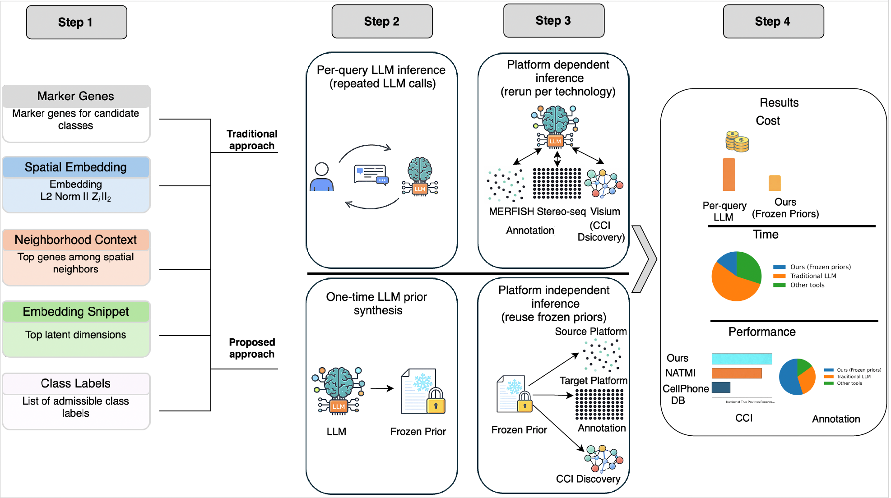

# Learning Frozen LLM Priors for Platform-Agnostic, Interpretable, and Scalable Spatial Transcriptomics

## Overview

Large language models (LLMs) can reason over heterogeneous biological evidence, but their direct use as per-query inference engines is costly, stochastic, and difficult to audit at scale.  
This repository implements an amortized LLM workflow for spatial transcriptomics, where one-time LLM reasoning is distilled into frozen, reusable priors that support deterministic, interpretable, and scalable downstream analysis.

We demonstrate this paradigm on two core spatial transcriptomics tasks:

1. **Cell-type annotation** using frozen LLM-derived gene-set priors and transparent statistical testing  
2. **Cell–cell interaction (CCI) inference** using frozen LLM interaction judgments distilled into a surrogate model  

The workflow replaces repeated LLM calls with platform-agnostic priors that can be reused across datasets, technologies, and scales.

## Conceptual Workflow

  

**Figure 1 | Amortized LLM workflow.**  
Top: traditional per-query LLM inference requires repeated, stochastic calls and platform-specific reruns.  
Bottom: the proposed approach uses the LLM once to synthesize frozen priors, which are then reused deterministically across platforms for annotation and CCI discovery.

## Getting Started

### Requirements

- **Python ≥ 3.9**
- **Core packages**
  - `scanpy`
  - `torch`
  - `torch-geometric`
  - `scikit-learn`
- **LLM access**
  - An LLM API is required **only** for the prior synthesis notebooks  
    (all downstream analyses run deterministically without LLM calls)

---
### LLM Models Used

This repository uses Google Gemini models **only during the one-time prior synthesis stage**.  
No LLM calls are required for downstream annotation, ablation, cross-platform transfer, or CCI screening.

- **Gemini 2.5 Pro**
- **Gemini 2.5 Flash**

### Recommended Execution Order

We recommend running the notebooks in the following order to reproduce the results in the manuscript:

1. `01_llm_prior_synthesis.ipynb`  
   *One-time LLM reasoning to synthesize frozen gene-set priors*

2. `02_welch_test_annotation.ipynb`  
   *Cell-type annotation using frozen LLM priors and Welch’s t-test*

3. `03_cross_platform_transfer.ipynb`  
   *Direct transfer of frozen priors from MERFISH to Stereo-seq*
   
4. `04_cell_cell_interaction/`  
   *Cell–cell interaction inference, prompt ablations, and surrogate distillation*

---

## Datasets

All datasets used in this study are publicly available and were accessed from the following sources.

### MERFISH (Mouse Brain)

- **Accessed from:**  
  https://squidpy.readthedocs.io/en/stable/notebooks/tutorials/index.html
- **Original publication:**  
  Moffitt *et al.*, *Science* (2018)  
  https://www.science.org/doi/10.1126/science.aau5324

---

### Stereo-seq (Mouse Brain)

- **Accessed from:**  
  https://db.cngb.org/stomics/datasets/STDS0000139/summary
- **Original publication:**  
  Cheng *et al.*, *Frontiers in Cell and Developmental Biology* (2022)  
  https://www.frontiersin.org/journals/cell-and-developmental-biology/articles/10.3389/fcell.2022.878346/full

---

### Visium IPF Lung (Cell–Cell Interaction Benchmark)

- **Accessed from:**  
  https://www.nature.com/articles/s41588-024-01819-2
- **Platform:**  
  10x Genomics Visium
