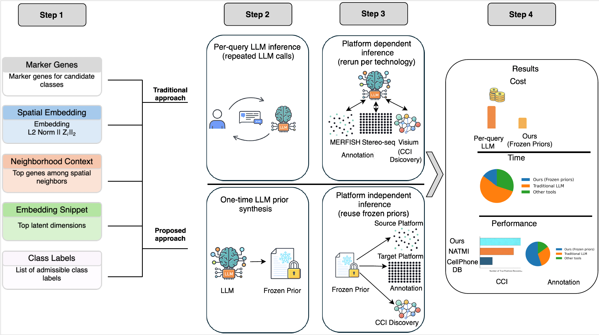

# Learning Frozen LLM Priors for Platform-Agnostic, Interpretable, and Scalable Spatial Transcriptomics

## Overview

Large language models (LLMs) can reason over heterogeneous biological evidence, but their direct use as per-query inference engines is costly, stochastic, and difficult to audit at scale.  
This repository implements an amortized LLM workflow for spatial transcriptomics, where one-time LLM reasoning is distilled into frozen, reusable priors that support deterministic, interpretable, and scalable downstream analysis.

We demonstrate this paradigm on two core spatial transcriptomics tasks:

1. **Cell-type annotation** using frozen LLM-derived gene-set priors and transparent statistical testing  
2. **Cell–cell interaction (CCI) inference** using frozen LLM interaction judgments distilled into a surrogate model  

The workflow replaces repeated LLM calls with platform-agnostic priors that can be reused across datasets, technologies, and scales.

## Conceptual Workflow

  

**Figure 1a | Amortized LLM workflow.**  
Top: traditional per-query LLM inference requires repeated, stochastic calls and platform-specific reruns.  
Bottom: the proposed approach uses the LLM once to synthesize frozen priors, which are then reused deterministically across platforms for annotation and CCI discovery.
